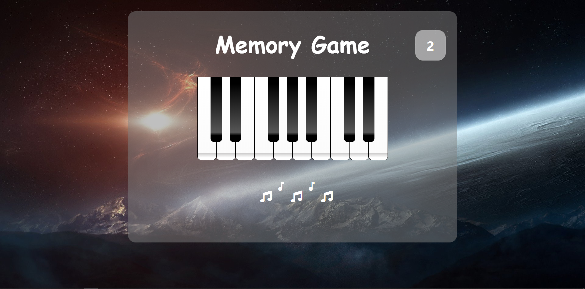

# Memory-Game
The principle of the game is simple: the player have to memorize the series of illuminated keys and reproduce it. the purpose of the game is to reproduce the longest series of colors / sounds randomly generated by the game.

In my game, you can change the game's difficulty level before to start the game. There are two mode, easy and hard. For beginners, I recommend that you start with an easy mode and then you can change difficulty level.

Easy...

Hard...

Enjoy the game.
